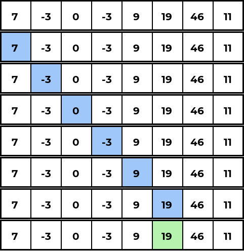
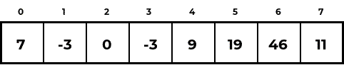
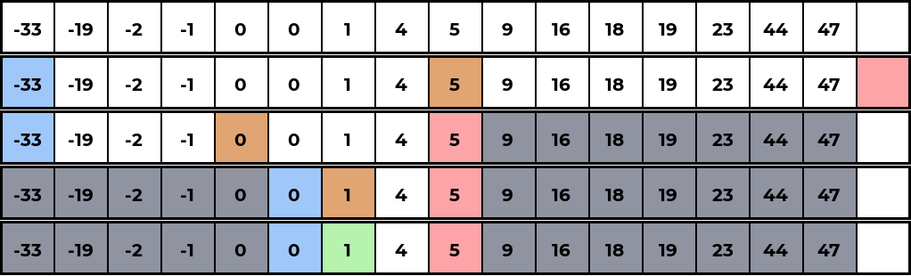
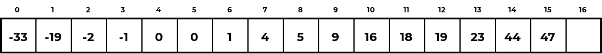

# Searching Algorithms

- [Linear Search](#linear-search)

## Linear Search <a name="linear-search"></a>

Iterate over each element in the list, returning the index if that element is equal to the element being searched for.




#### Implementation:

```C
int linear_search(int A[], int n, int x) {
    for(int i = 0; i < n; i++) {
        if(A[i] == x) {
            return i;
        }
    }
    return -1;
}
```

## Binary Search <a name="binary-search"></a>

Assuming an already sorted array, take `l` (low) to be the `0` and `h` (high) to be the number of elements in the array. We then proceed as follows:

1. Set `m` (mid) to be the average of `l` and `h`, rounded down.
2. Check if the element at index `m` is greater than the element being searched for. If it is, since the array is sorted, we know that if the element exists, it must be to the left of `m`. So set `h` to be equal to `m` and return back to step 1.
3. If the check at step 2 returned false, check if the element at index `m` is less than the element being searched for. If it is, since the array is sorted, we know that if the element exists, it must be to the right of `m`. So set `l` to be equal to `m+1` and return back to step 1.
4. If neither step 2 nor step 3 returned true, then it must be the case that the element at index `m` is equal to the element being searched for, so we return `m`.
5. If the element does not exist in the array, through the procedures from steps 2 and 3, `l` and `h` will eventually be such that `h` is greater than or equal to `l`. If this is the case, return `-1` indicating that the element is not in the array.




#### Implementation:

```C
int binary_search(int A[], int n, int x) {
    int l = 0, h = n;
    while(l < h) {
        int m = (l+h)/2;
        if(A[m] > x) {
            h = m;
        } else if(A[m] < x) {
            l = m+1;
        } else {
            return m;
        }
    }
    return -1;
}
```
