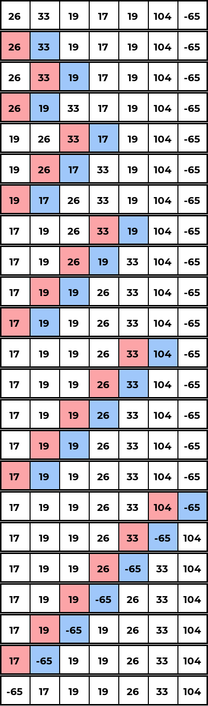
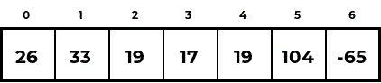
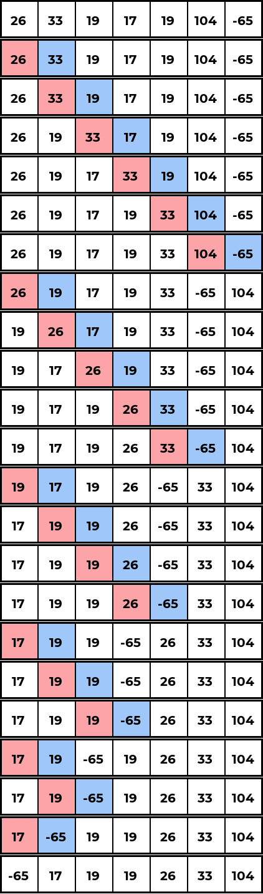

# Sorting Algorithms

- [Insertion Sort](#insertion-sort)
- [Bubble Sort](#bubble-sort)
- [Selection Sort](#selection-sort)
- [Merge Sort](#merge-sort)
- [Quick Sort](#quick-sort)

## Insertion Sort <a name="insertion-sort"></a>

Iterate over all elements of the list, and for each element, compare it with the elements to its left to find the position at which it belongs and put it there.





#### Implementation:

```C
int* insertion_sort(int A[], int n) {
    /* iterate from left to right */
    for(int i = 1; i < n; i++) {
        /* iterate from the item currently being examined to the start of the array */
        for(int j = i; j > 0; j--) {
            /* swap if the item currently being examined is less than the one to its left */
            if(A[j] < A[j-1]) {
                swap(&A[j], &A[j-1]);
            }
        }
    }
    return A;
}
```

## Bubble Sort <a name="bubble-sort"></a>

Repeatedly compare adjacent pairs, swapping them if they are out of order. After the `i`'th iteration, the last `i` items should be sorted as the largest element will always 'bubble' to the end of the array.




#### Implementation:

```C
int* bubble_sort(int A[], int n) {
    for(int i = 0; i < n; i++) {
        /* by the ith iteration, the last i items should already be sorted */
        for(int j = 0; j < n-1-i; j++) {
            if(A[j] > A[j+1]) {
                swap(&A[j], &A[j+1]);
            }
        }
    }
    return A;
}
```

## Selection Sort <a name="selection-sort"></a>

Logically divide the array into two subarrays; a sorted subarray and an unsorted subarray. Add items to the sorted subarray by iteratively selecting the smallest item in the unsorted subarray and placing it at the end of the sorted subarray. When the unsorted subarray is empty, the result is a sorted array. This is an in-place algorithm; the sorted and unsorted subarrays make up the input array.

#### Implementation:

```C
int* selection_sort(int A[], int n) {
    for(int i = 0; i < n-1; i++) {
        int current_min = A[i]; /* minimum item in the unsorted subarray */
        int min_index = i;
        /* search the rest of the unsorted subarray for a smaller item */
        for(int j = i+1; j < n; j++) {
            if(A[j] < current_min) {
                current_min = A[j];
                min_index = j;
            }
        }
        swap(&A[min_index], &A[i]); /* move the smallest item in the unsorted subarray to the end of the sorted subarray */
    }
    return A;
}
```

## Merge Sort <a name="merge-sort"></a>

Make use of a `merge` helper function which merges two sorted arrays in linear time. An array of size one is trivially sorted, so the input array of size `n` is partitioned into `n` arrays of size 1, each holding a single item. The partitions are then merged to form the sorted array.

#### Implementation:

```C
int* merge_sort(int A[], int n) {
    int* merge(int A1[], int A2[], int n1, int n2) {
        int* merged_arr = (int*)malloc(sizeof(int)*(n1+n2));
        int i = 0;
        while(n1 && n2) {
            if(A1[0] <= A2[0]) {
                merged_arr[i] = A1[0];
                A1++; n1--;
            } else {
                merged_arr[i] = A2[0];
                A2++; n2--;
            }
            i++;
        }
        if(n1) { /* n1 still has items */
            while(n1) {
                merged_arr[i] = A1[0];
                A1++; i++; n1--;
            }
        } else if(n2) { /* n1 still has items */
            while(n2) {
                merged_arr[i] = A2[0];
                A2++; i++; n2--;
            }
        }
        return merged_arr;
    }
    int* partitions_buffer = (int*)calloc(n, sizeof(int)); /* auxiliary storage for sorted partitions */
    for(int i = 0; i < n; i++) partitions_buffer[i] = A[i]; /* initialise array of single item sorted partitions */
    for(int partition_size = 1; partition_size < n; partition_size *= 2) {
        for(int i = 0; i < n; i+=2*partition_size) {
            if(i+partition_size >= n) break; /* odd number of partitions */
            int partition_size2 = MIN(n-i-partition_size, partition_size); /* for when there were previously odd partitions */
            int* merged = merge(&partitions_buffer[i], &partitions_buffer[i+partition_size], partition_size, partition_size2);
            /* update the partition buffer with the merged array */
            int k = 0;
            for(int j = i; j < i+2*partition_size; j++) {
                partitions_buffer[j] = merged[k];
                k++;
            }
        }
    }
    return partitions_buffer;
}
```

## Quick Sort <a name="quick-sort"></a>

Partition the array into subarrays by choosing an element to be the pivot and rearranging the elements so that all elements to the left of the pivot are less than or equal to the pivot, and all elements to the right are more than it. 
To partition the array, use two trackers `l` and `h`. `l` starts from the left and moves right by one if `A[l]` is less than the pivot, while `h` starts from the right and moves left by one if `A[h]` is more than the pivot. When neither is true, we have found an element to the left of the pivot that is greater than the pivot, and an element to the right of the pivot that is smaller than the pivot, so we swap these two elements. Once `l` and `h` cross, all elements to the left of the pivot should be less than the pivot, and all elements to the right of the pivot should be greater than the pivot. The pivot's index will then be given by `h`.

#### Implementation:

```C
int* quick_sort(int A[], int n) {
    int partition(int A[], int l, int h) {
        int pivot = A[(l+h)/2]; /* take the middle element to be the pivot */
        /* using two trackers l and h, move l from the left to the right until
         * an element larger than the pivot is found, do the same for the h tracker
         * starting from the right, moving left until a smaller element is found.
         * once found, swap the two elements and update the trackers.
         * once the two trackers cross, the pivot's final position should be at
         * where the h pointer ends up */
        while(1) {
            while(A[l] < pivot) l++;
            while(A[h] > pivot) h--;
            if(l >= h) return h;
            swap(&A[l], &A[h]);
            l++; h--;
        }
    }
    int* qsort(int A[], int l, int h) {
        if(l < h) {
            int p = partition(A, l, h);
            qsort(A, l, p-1); /* sort below the pivot */
            qsort(A, p+1, h); /* sort above the pivot */
        }
        return A;
    }
    return qsort(A, 0, n-1);
}
```
